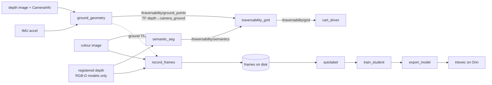

# Components

## ROS nodes (`traversability/*_node.py`, console scripts)

| Executable | Role |
| --- | --- |
| `ground_geometry` | plane fit and per-point labels; publishes the labelled organised cloud and the TF to `camera_ground` |
| `semantic_seg` | runs a segmentation backend; publishes class image and overlay |
| `traversability_grid` | rasterises points (and fuses semantics) into the occupancy grid |
| `record_frames` | saves colour, registered depth and the ground plane for training |
| `depth_noise` | adds D435-like noise (σ_z = c·z²) to perfect sim depth |
| `spawn_test_scene` / `check_test_scene` | Webots test scene and its pass/fail check |
| `snapshot` | PNG of colour, labels and grid, for headless checks over SSH |

## Libraries (pure numpy/cv2, unit-tested, run on the Orin unchanged)

| Module | Role |
| --- | --- |
| `geometry.py` | back-projection, vectorised RANSAC, plane tracker, height labelling, `height_above` |
| `grid.py` | rasterisation, gap filling, grid values |
| `fusion.py` | per-cell fusion and the patch rule |
| `semantics.py` | label-set mapping to the four classes |
| `segmentation.py` | backends: `hf:`, `student:`, `trt:` |
| `cloud.py`, `transforms.py` | PointCloud2 and TF helpers |
| `test_scene.py` | scene definition shared by spawn and check |

## Offline tools (`traversability/learning/`, need torch; laptop)

`autolabel`, `train_student`, `export_model`, `benchmark_models`
(`data.py`, `model.py`, `heads.py`, `train.py`, `export.py`, `benchmark.py`).
`tools/` has `sim_slow_follower.py` (drives the sim city at 15 km/h),
`sim_clutter_spawner.py` (scatters flat clutter and grass ahead) and
`make_textures.py`.

## Launch files

| File | Starts |
| --- | --- |
| `traversability.launch.py` | sim pipeline: `ground_geometry`, `traversability_grid`, optional `depth_noise` and `semantic_seg` |
| `d435i.launch.py` | `realsense2_camera` (scoped in a `GroupAction`) + pipeline, optional RViz, semantics, alignment, recording |
