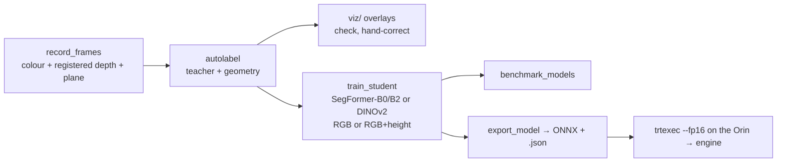

# Phase 3: learning pipeline

1. **Record:** `d435i.launch.py align:=true record_dir:=...` on the camera,
   `record_frames` in the sim, or a bag replayed through `ground_geometry` +
   `record_frames`. One frame every 0.5 s by default.
2. **Auto-label** (`autolabel <dir> --viz`): Mask2Former Swin-L (Mapillary
   Vistas) labels each pixel; geometry corrects it:
   - anything raised above the ground becomes "other" — but only overriding
     a teacher **road** label, so verges stay terrain and curbs sidewalk;
   - small flat "other" blobs surrounded by flat road become **road** (this
     teaches the student that paint and paper are road);
   - geometry is trusted only within 6 m, and thresholds widen with distance
     (c = 0.01), because real D435i noise is about twice the first estimate;
   - low-confidence pixels are ignored.
3. **Train** (`train_student --data <dirs> [--idd <root>] --arch segformer-b0 --rgbd --out <dir> --export`):
   SegFormer-B0/B2 from Cityscapes weights, or DINOv2-small/base with a
   linear head. `--rgbd` adds height above ground as a 4th channel,
   zero-initialised so training starts from the RGB model. Augmentation
   pastes synthetic paper, paint and stains onto road (labelled road) and
   randomly drops the height channel. IDD frames (no depth) always train with
   height dropped. Validation: every 10th frame, or `--val-tail 0.25` for
   recordings (hold out the end of the drive).
4. **Benchmark** (`benchmark_models --data <dirs> --every 10 | --tail 0.25 --models ...`):
   per-class IoU, flat-road recall, forbidden recall, latency.
5. **Export and deploy**: ONNX + `.json` sidecar; on the Orin
   `trtexec --onnx=m.onnx --saveEngine=m.engine --fp16`; keep the `.json`
   next to the engine; run with `model:=trt:m.engine`.

**Limit:** a student can't beat its teacher on forbidden surfaces; geometry
can only turn patches into road. Human labels (IDD, corrected campus frames)
are the fix ([Q-001](../06-open-questions/Q-001-models-call-flat-grass-road.md)).
